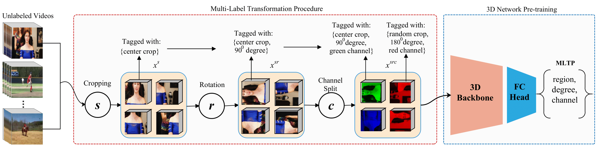
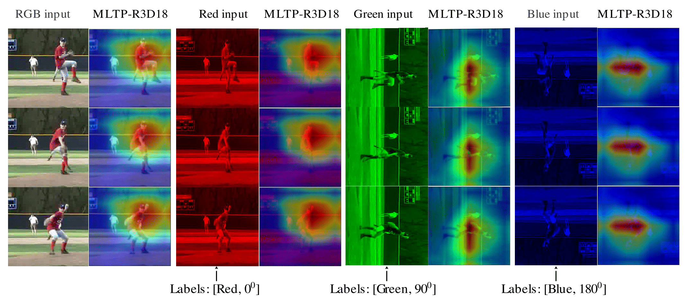
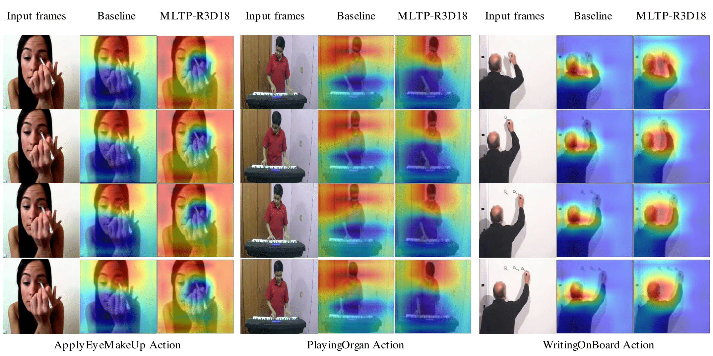

# Self-Supervised Multi-Label Transformation Prediction for Video Representation Learning
This is the implementation for "**MLTP: Self-Supervised Multi-Label Transformation Prediction for Video Representation Learning**". The paper can be found [https://doi.org/10.1142/S0218126622501596](https://www.worldscientific.com/doi/abs/10.1142/S0218126622501596)

### The Proposed Proxy Task

<div style='float: center'>
  </img>
</div>

### Qualitative Results
Can MLTP learn spatiotemporal representations?
Class Activation Maps (Grad-CAM) of *Baseball player* video frames generated from the pre-trained MLTP-R3D18
backbone.
<div style='float: center'>
  </img>
</div>

Generalization capability of MLTP-R3D18 on three unseen action classes.
<div style='float: center'>
  </img>
</div>

Run the following commands,
```
python main.py
```
``` 
python inference.py
```
```
python fine_tune.py
```

## Citation
If you find this code useful for your research, please cite our paper:

    @article{assefa2022self,
      title={Self-Supervised Multi-Label Transformation Prediction for Video Representation Learning},
      author={Assefa, Maregu and Jiang, Wei and Yilma, Getinet and Kumeda, Bulbula and Ayalew, Melese and Seid, Mohammed},
      journal={Journal of Circuits, Systems and Computers},
      pages={2250159},
      year={2022},
      publisher={World Scientific}
    }
